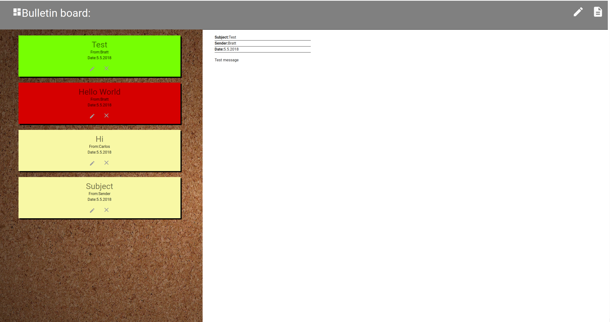

# BulletinBoard

<H3>Updated: 07.11.2018 <H3>
<h2> Status: Failing</h2>
<b>0.1.0.0</b>
 
 

<b>Done:</b>
 
-reading posts 
 
-API endpoints 
 
-modify post
 
-delete post
 
-insert post
 
-mongoDB
 
 

<b>ToDo:</b>
 
-styling form
 
-authentication
 
-Scaling for mobile

 
 
<b>What this app is:</b>
 
Test project to practise React development and Nodejs.
 
Bulletin board is made with React front and Nodejs backend.
Mongodb is required to store data.
 
 
 

